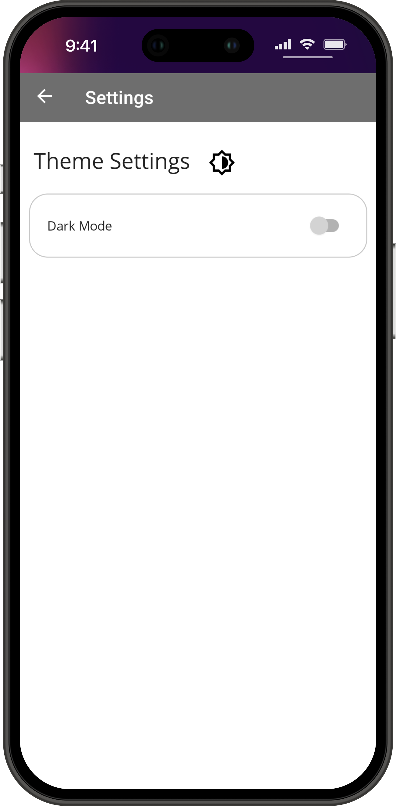

# .Net MAUI To-Do List App 
A `To-Do list` app that performs CRUD operations. Made with `.Net MAUI` & `SQLite`

# CI/CD Status

# Maintenance Status 🔹<a href="https://github.com/OudomMunint/.NetMAUI-To-Do-List-App/issues">Report Bug</a> &nbsp; &nbsp;

# Supported Platforms
<table>
  <tr>
    <th>Platform</th>
    <th>Version</th>
    <th>Target</th>
  </tr>
  <tr>
    <td>Android</td>
    <td>API 31+</td>
    <td>API 33</td>
  </tr>
  <tr>
    <td>iOS</td>
    <td>iOS 14.2+</td>
    <td>iOS 16.3</td>
  </tr>
  <tr>
    <td>macOS</td>
    <td>macOS 12+ (Monterey)</td>
    <td>macOS 13.4 (Ventura)</td>
  </tr>
</table>

<h1 float="center">
  
  
</h1>

## Upcoming
- `Bottom Sheets` to pull up edit screen or create task screen
- `MultiSelect` for bulk delete
- Data visualization with `Charts` or `Graphs`
- WIP: SwipeView Add, SwipeView Delete

## Getting Started
- Install <a href="https://visualstudio.microsoft.com/downloads/" target="_blank">`Visual Studio`</a> on your machine and while choosing components you must check the <a href="https://dotnet.microsoft.com/en-us/learn/maui/first-app-tutorial/install" target="_blank">`.NetMaui`</a> box to install .NetMaui.
- Install <a href="https://developer.android.com/studio?gclid=Cj0KCQiAnNacBhDvARIsABnDa6-EYNc5MIjFoAruujioi9l-gjeu8JVsJd_aqCGGhImxOZkFyoo_woYaAoOCEALw_wcB&gclsrc=aw.ds" target="_blank">`Android Studio`</a> on your machine.
- Create a virtual device with andoid API 31, 32 or 33.
- Clone, download or fork this repository.
- Delete the `bin` and `obj` folder if present.
- Open the solution file
- ctr + Shift + B to build
- Run the solution.
- If build failed with Dependency errors, please unload the project and reload with dependencies.
- Has `SQLite` dependency.