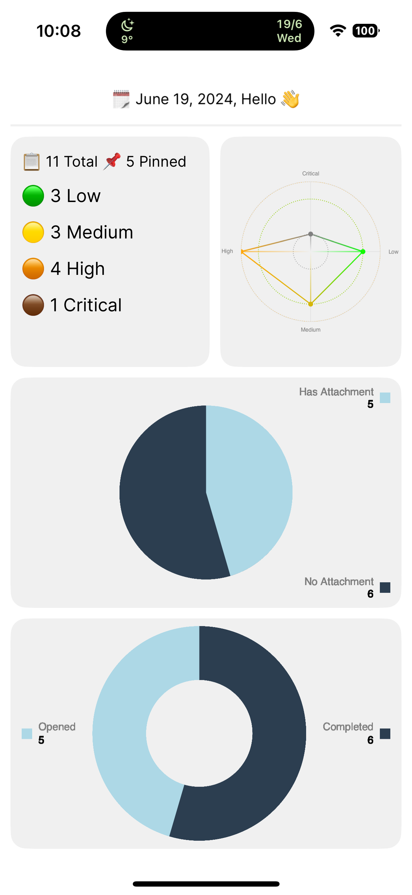
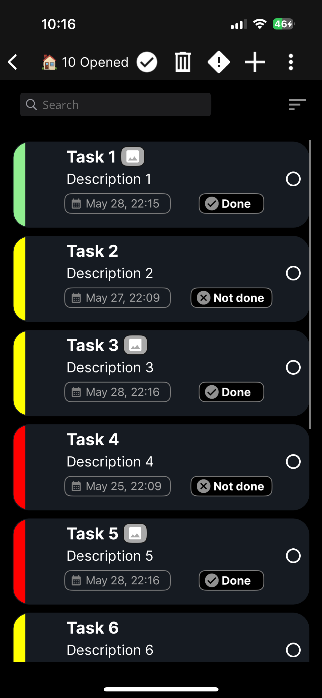
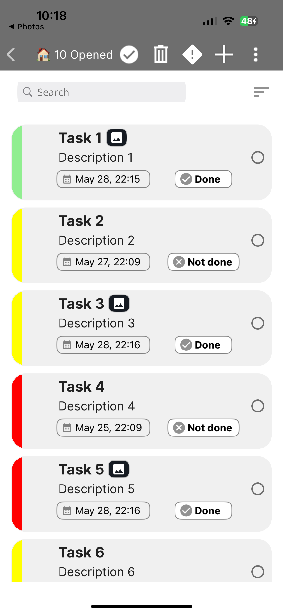
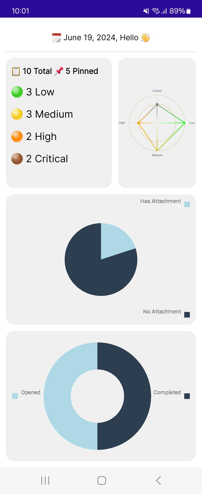
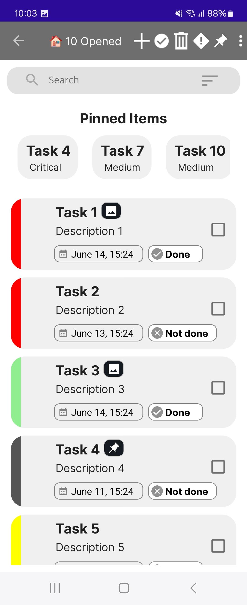
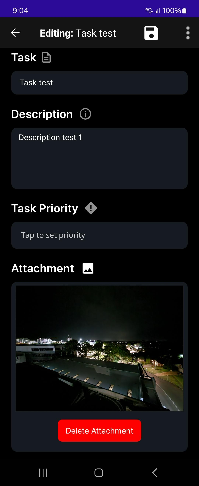
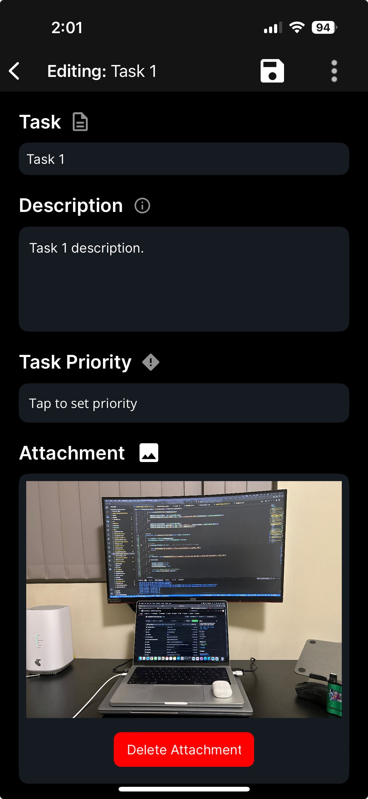

# Check Mate ✅

A `To-Do list` app that performs CRUD operations. Made with `.Net MAUI` & `SQLite`

- No Login required.
- No Internet connection required.

# CI/CD Status & Release

# Maintenance Status 🔹<a href="https://github.com/OudomMunint/.NetMAUI-To-Do-List-App/issues">Report Bug</a> &nbsp; &nbsp;

# Supported Platforms

<table>
  <tr>
    <th>Platform</th>
    <th>Version</th>
    <th>Target</th>
    <th>Latest Stable</th>
  </tr>
  <tr>
    <td>Android</td>
    <td>API 21+</td>
    <td>API 34 / Android 14</td>
    <td>Android 14</td>
  </tr>
  <tr>
    <td>iOS</td>
    <td>iOS 11+</td>
    <td>iOS 16 & 17</td>
    <td>iOS 16.7.8 & 17.5.1</td>
  </tr>
</table>

# Required SDKs

- .Net 8.0 from <a href="https://dotnet.microsoft.com/download/dotnet/8.0" target="_blank">`here`</a>
- XCode 15 from <a href="https://developer.apple.com/xcode/" target="_blank">`here`</a>

# Screenshots
### iOS, iPhone 15
<h1 float="center">
  
  
</h1>

<h1 float="center">
  
  
</h1>

### Android, Galaxy Z Flip 4
<h1 float="center">
  
  
</h1>

### Android & iOS, Galaxy Z Flip 4 / iPhone 15
<h1 float="center">
  
  
</h1>

## Upcoming

- [ ] Swipe gestures
- [x] Dark mode
- [ ] Bottom Sheets
- [x] Attachments
- [x] Charts, Data Visualization
- [x] Foldable device support
- [x] .Net 8 Support

## Getting Started

- Install `.NET 8` SDK from <a href="https://dotnet.microsoft.com/download/dotnet/8.0" target="_blank">`here`</a> on your machine.
- Install <a href="https://visualstudio.microsoft.com/downloads/" target="_blank">`Visual Studio`</a> on your machine and while choosing components you must check the <a href="https://dotnet.microsoft.com/en-us/learn/maui/first-app-tutorial/install" target="_blank">`.NetMaui`</a> box to install .NetMaui.
- Install <a href="https://developer.android.com/studio?gclid=Cj0KCQiAnNacBhDvARIsABnDa6-EYNc5MIjFoAruujioi9l-gjeu8JVsJd_aqCGGhImxOZkFyoo_woYaAoOCEALw_wcB&gclsrc=aw.ds" target="_blank">`Android Studio`</a> on your machine.
- Create a virtual device with andoid API 31 || 32 || 33 ||34.
- Clone, download or fork this repository.
- Open the solution file, build then run with selected device.
- If build failed with Dependency errors, please unload the project and reload with dependencies.
- Or `cd` to the project directory and run `dotnet restore {name}.sln` to restore dependencies.
- Has `SQLite` & `XUnit` dependency.

## Getting Started iOS

- Install `.NET 8` SDK from <a href="https://dotnet.microsoft.com/download/dotnet/8.0" target="_blank">`here`</a> on your machine.
- Install <a href="https://visualstudio.microsoft.com/vs/mac/" target="_blank">`Visual Studio for mac`</a> on your machine and while choosing components you must check the `.NetMaui` box.
- Install <a href="https://developer.apple.com/xcode/" target="_blank">`XCode`</a> on your machine.
- Clone, download or fork this repository.
- Open the solution file, build then run with selected device iOS 15+.
- If build failed with Dependency errors, please unload the project and reload with dependencies.
- Or `cd` to the project directory and run `dotnet restore {name}.sln` to restore dependencies.
- Has `SQLite` & `XUnit` dependency same with android.

## Permissions
- Android: `Read & Write External Storage`, `Read & Write Internal Storage`, `Camera access`, `Haptic feedback`.
- iOS: `Camera access`, `Photo Library access`, `Read & Write External Storage`, `Read & Write Internal Storage`, `Haptic feedback`.

## Clean scripts

### This script finds and deletes `bin` / `obj` folders as well as `.DS_Store` files.

- Place the `build.sh` in the root directory of your project.
- cd to the root directory of your project.
- Open the terminal and run `chmod +x build.sh` to make the script executable.
- Run `./build.sh` to clean the project.
- on macos, you can run `sh build.sh` to clean the project.